# RITM-200 SMR Dynamics Simulator

**A coupled neutronics · thermal-hydraulics · steam-generator model of a small modular reactor, in Python.**


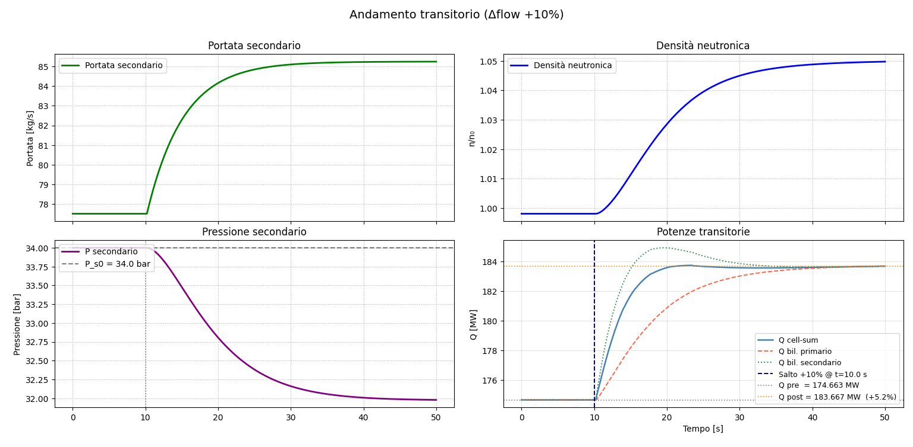

> *A +10% step in secondary mass flow propagates through the whole plant: secondary flow ↑, secondary pressure ↓, neutron density ↑, exchanged thermal power 174.7 MW → 183.7 MW. The core raises its own power to meet turbine demand, with no control-rod action — PWR load-following, reproduced from first principles.*

---

## At a glance

| | |
|---|---|
| **Physics coupled** | Six-group point kinetics · 3-node radial fuel model · 1D two-phase steam generator · secondary pressure dynamics |
| **Stiff ODE system** | 12 coupled equations spanning ~5 orders of magnitude in timescale (Λ ≈ 10⁻⁴ s → thermal τ ≈ 10 s) |
| **Spatial discretization** | Up to 1,000 axial finite-volume cells; one reduced channel representing 9,912 parallel sub-channels |
| **Steady-state accuracy** | Energy balance closes to **< 0.001%** across three independent estimates |
| **Transients simulated** | +10% secondary flow (load-following) · 3 cm control-rod insertion (upstream power control) |
| **Stack** | Python · NumPy · SciPy (`solve_ivp`/LSODA, `fsolve`, `root_scalar`) · pyXSteam · Matplotlib |

---

## Table of contents

- [Overview](#overview)
- [Why RITM-200](#why-ritm-200)
- [Reactor specifications](#reactor-specifications)
- [Model architecture](#model-architecture)
  - [1. Neutronics](#1-neutronics--six-group-point-kinetics)
  - [2. Core thermal-hydraulics](#2-core-thermal-hydraulics--3-node-radial-fuel-model)
  - [3. Steam generator](#3-steam-generator--cassette-type-heat-exchanger)
  - [4. Secondary pressure dynamics](#4-secondary-pressure-dynamics)
  - [5. Full-system coupling](#5-full-system-coupling)
- [Numerical methods](#numerical-methods)
- [Verification](#verification)
- [My role in this project](#Contributions)
- [Results](#results)
  - [A. Load-following](#a-load-following--10-secondary-mass-flow)
  - [B. Control-rod insertion](#b-upstream-power-control--3-cm-control-rod-insertion)
  - [The physics takeaway](#the-physics-takeaway)
- [Assumptions and limitations](#assumptions-and-limitations)
- [Future work](#future-work)
- [Repository structure](#repository-structure)
- [Getting started](#getting-started)
- [Figures and full report](#figures-and-full-report)
- [References](#references)
- [Team and academic context](#team-and-academic-context)
- [License](#license)

---

## Overview

This repository implements a coupled dynamic model of the **RITM-200**, a Generation III+ PWR-type small modular reactor currently in commercial operation aboard the floating nuclear power plant *Akademik Lomonosov* — one of very few SMR designs anywhere to have reached commercial service.

The model integrates three physical sub-systems, entirely in Python:

1. **Point-kinetics neutronics** with six delayed-neutron precursor groups
2. **Core thermal-hydraulics** with a 3-node radial fuel model
3. **A 1D finite-volume steam generator** — counter-current, coaxial-tube, cassette-type, as in the real reactor

plus a first-order **secondary-side pressure model**, all coupled through the primary circuit's hot-leg and cold-leg temperatures and advanced on a shared time grid.

Two realistic operational transients are simulated and analysed end to end: a **secondary flow-rate ramp** (demonstrating PWR/SMR *load-following*) and a **control-rod insertion** (demonstrating *upstream* power control). Both show a perturbation in one sub-system propagating correctly through the entire coupled model to a new, stable equilibrium.

Beyond the nuclear domain, this is a study in coupling stiff solvers across widely separated timescales, choosing implicit schemes where stability governs cost, and verifying results against independent physical balances rather than trusting a single number.

For more details about the project, please see the **Report files** in the Docs folder.

## Why RITM-200

Large PWR plants have struggled with rising capital costs and long build times. SMRs offer lower financial risk and more flexibility, and their compact size makes passive safety features easier to integrate. RITM-200 is a leading real-world example: the core, all four heat exchangers and pressure regulation are integrated **inside a single vessel**, with no separate pressuriser — a layout that cuts piping, and with it both cost and a class of accident scenarios.

That compactness also tightens the coupling between sub-systems. Understanding how such a design responds dynamically to operational changes — and confirming it settles into a new stable state rather than diverging — is exactly the question this project sets out to answer.

## Reactor specifications

| Parameter | Value |
|---|---|
| Reactor type | PWR, Generation III+ SMR |
| Thermal power | 175 MW |
| Electrical power | 2 × 55 MWe |
| Design life | 60 years |
| Fuel enrichment | 14.06% |
| Refuelling interval | 6 yr (land-based) / 10 yr (marine propulsion) |
| Primary pressure | 15.7 MPa |
| Coolant inlet / outlet temperature | 277 °C / 313 °C |
| Primary mass flow rate | 3,250 t/h |
| Secondary pressure | 3.4 MPa |

---

## Model architecture

### 1. Neutronics — six-group point kinetics

Neutron density $n(t)$ and six precursor concentrations $C_i(t)$:

$$\frac{dn}{dt} = \frac{\rho - \beta}{\Lambda}\,n \;+\; \sum_{i=1}^{6}\lambda_i C_i \,, \qquad \frac{dC_i}{dt} = \frac{\beta_i}{\Lambda}\,n - \lambda_i C_i$$

Reactivity is a linearised sum of two intrinsic feedbacks and one control input:

$$\rho = \underbrace{\alpha_f\,(T_f - T_{f0})}_{\text{Doppler}} + \underbrace{\alpha_m\,(T_c - T_{c0})}_{\text{moderator density}} + \underbrace{\alpha_h\,(h - h_0)}_{\text{control rods}}$$

Delayed neutrons are only ≈ 0.65% of the total, but they are what makes the plant controllable at all: they stretch power-excursion timescales from fractions of a millisecond to tens of seconds, which is what gives mechanical control systems time to act.

### 2. Core thermal-hydraulics — 3-node radial fuel model

<p align="center">
  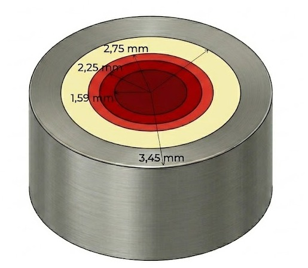
</p>

The fuel pin is split into **three concentric nodes** (a solid inner cylinder plus two annular shells, with radii $r_1 = r_f/\sqrt{3}$ and $r_2 = r_f\sqrt{2/3}$) to resolve the ~300 °C temperature drop across just a few millimetres of pellet radius — a gradient a single lumped node would completely miss.

- Temperature-dependent fuel conductivity and specific heat (Fink–Touloukian-type correlations)
- Series thermal resistance: fuel → helium gap → cladding → convection
- Dittus–Boelter convection, $Nu = 0.023\,Re^{0.8}Pr^{0.4}$, with a Weisman correction for the triangular rod-bundle lattice
- **12 coupled stiff ODEs** in total: 6 precursors + neutron density + 3 fuel nodes + cladding + coolant

### 3. Steam generator — cassette-type heat exchanger

<p align="center">
  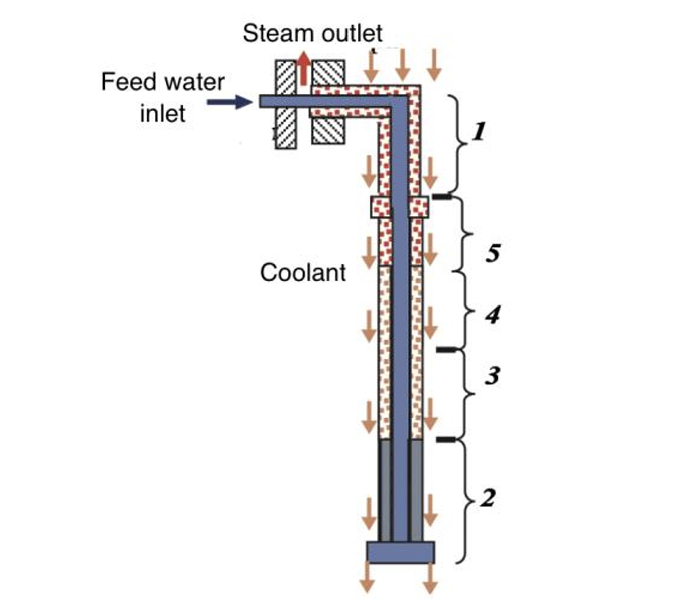
  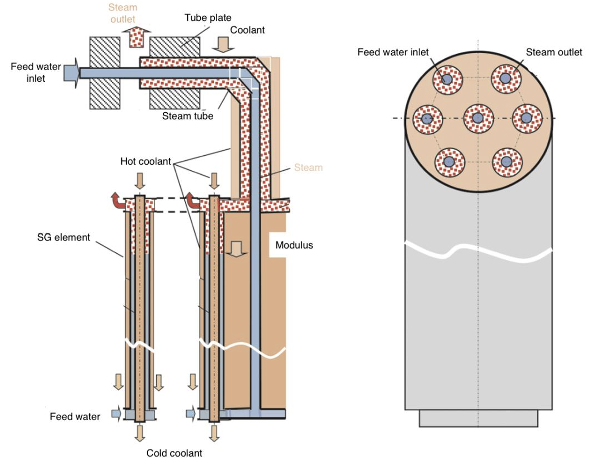
</p>

Four once-through, counter-current, coaxial-tube exchangers per reactor. Each channel has three concentric regions: **inner tube** (primary) · **annulus** (secondary) · **shell** (primary, triangular-pitch tube bundle).

Cylindrical symmetry reduces the problem from 3D to 1D along the axial coordinate $z$, discretised into up to 1,000 finite volumes over a 1.9 m active length. The full plant's **9,912 parallel sub-channels** are represented by one channel, assuming even flow distribution.

**Two-phase secondary side.** The secondary fluid crosses the exchanger from subcooled liquid through saturated boiling to superheated steam. Local phase is determined from cell enthalpy against saturation values; in the two-phase region a Saha-type nucleate-boiling correlation is used, blended linearly into the superheated-vapour coefficient above a vapour quality of 0.8 to model dryout / mist flow **without introducing a numerical discontinuity**.

**Per-cell resistance network** — two parallel paths (inner tube and outer tube) from primary to secondary, each a series of convection → wall conduction → convection:

<p align="center">
  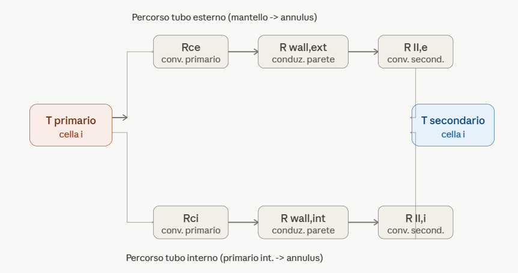
</p>

### 4. Secondary pressure dynamics

Turbine demand sets how much steam leaves the exchanger, which sets secondary pressure — and pressure in turn sets the saturation temperature, and therefore the temperature difference driving heat transfer. A first-order model derived from an internal-energy balance on the secondary fluid:

$$\frac{dP_s}{dt} \;\approx\; -K_p\,\delta\dot m \;-\; \frac{P_s - P_{s,0}}{\tau_p}, \qquad K_p = \frac{\Delta h_0}{M_s\,\dfrac{du_{sat}}{dP_s}}$$

with $K_p$ derived analytically from steam-table derivatives — computed value **52.36 × 10⁻³ bar/(kg/s/s)** — and $\tau_p = 5$ s, matched to the secondary pump's own time constant.

| +10% secondary flow | −10% secondary flow |
|---|---|
| 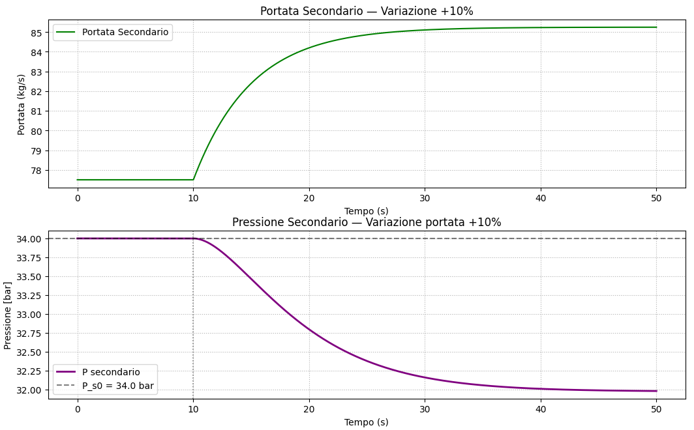 | 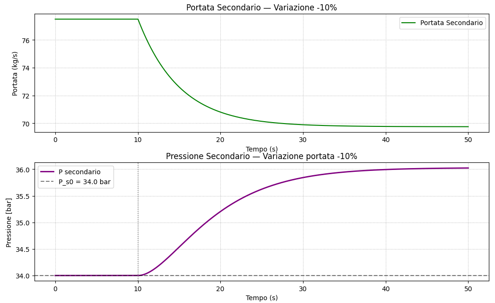 |

The pressure response looks slower than $\tau_p$ would suggest. That is not a bug: the instantaneous equilibrium point is itself moving, because the flow rate is still ramping with its own time constant. Pressure is chasing a moving target.

### 5. Full-system coupling

The core and steam generator are linked in a loop — hot leg feeds the SG, cold leg feeds the core — so neither can be solved in isolation. Both share a single time grid ($\Delta t = 0.2$ s), and each step runs:

```
SG update (implicit Euler, FV sweeps)
        │
        ▼
extract new cold-leg temperature  ──────►  core ODEs (LSODA)
        ▲                                        │
        │                                        ▼
  recompute reactivity  ◄──────────  updated fuel & coolant temperatures
```

This is a **sequential (operator-split) scheme**: it introduces a one-step lag in the coupling, negligible here because $\Delta t = 0.2$ s sits far below the tens-of-seconds time constants of the transients being studied.

Steady state is found by **nesting** a Powell-hybrid solve (5 core temperatures) inside a Brent root-find for the single cold-leg temperature that satisfies core and exchanger simultaneously.

---

## Numerical methods

| Task | Method | Tool |
|---|---|---|
| Core ODEs (12 stiff equations) | LSODA — adaptive Adams–Moulton ↔ BDF switching | `scipy.integrate.solve_ivp` |
| Core steady state (5 nonlinear equations) | Powell hybrid, finite-difference Jacobian | `scipy.optimize.fsolve` |
| Cold-leg steady-state search | Brent–Dekker | `scipy.optimize.root_scalar` (`brentq`) |
| SG transient | Backward (implicit) Euler, sequential upwind sweeps | custom |
| SG steady state | Continuous shooting + Brent, then implicit warm-up | custom + `root_scalar` |
| Water/steam properties | IAPWS-IF97 steam tables | `pyXSteam` |

Integration tolerances: `rtol = 1e-6`, `atol = 1e-8`.

**Why implicit, and why it paid off.** An explicit scheme on this axial mesh would be CFL-capped at roughly $10^{-3}$ s — unusable for simulating tens of seconds of transient. The implicit scheme is unconditionally stable, so the warm-up phase could run at $\Delta t = 1$ s (≈ 10× the primary coolant transit time through the SG), converging to the discrete steady state in **under 300 iterations** — about two orders of magnitude fewer steps than an explicit scheme would need.

**Why no matrix inversion.** Counter-current upwind advection is unidirectional in each fluid, so the implicit system factorises into two sequential sweeps — primary from $i = N-1 \to 0$, secondary from $i = 0 \to N-1$ — each a simple forward substitution. A full $2N \times 2N$ linear solve is avoided entirely, while the dominant advective terms stay implicit.

**Physical constraints enforced in the scheme.** Heat is never allowed to flow backwards from secondary to primary: if an implicit update would return $T_i^{n+1} < T_{II,i}$, the cell is recomputed with the exchange term zeroed, and the cell heat flux is clamped at $\max(0,\,T_i - T_{II,i})$.

---

## Verification

Rather than trusting a single output, the model was checked against independent physical balances:

- **Triple energy-balance cross-check.** Exchanged thermal power is computed three independent ways — cell-by-cell summation $\sum_i G_i(T_i - T_{II,i})$, a primary-side balance $\dot m_I c_{p,I}(T_{I,in} - T_{I,out})$, and a secondary-side balance $\dot m_{ann}(h_{out} - h_{in})$. At steady state they agree to **better than 0.001%**. All three are also plotted throughout every transient (the "Potenze transitorie" panels), so any drift between them would be visible immediately.
- **Two-stage steady state.** A continuous shooting solution is deliberately *not* trusted as an initial condition, because the continuous and discrete upwind schemes carry slightly different truncation errors. It is instead relaxed via implicit warm-up onto the discrete steady state, so the transient starts from a state genuinely stationary *for the scheme being used*.
- **Isolated feedback tests.** Each reactivity term was step-perturbed on its own to confirm the expected sign and relative strength:

| Doppler dominates → power decreases | Rod insertion → power decreases | Moderator dominates → divergence |
|---|---|---|
| 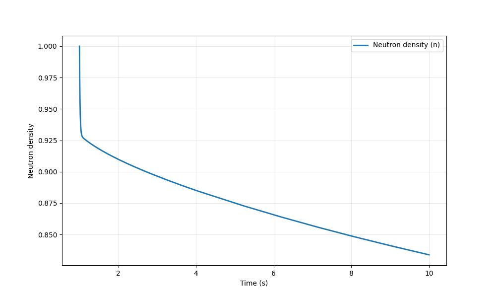 | 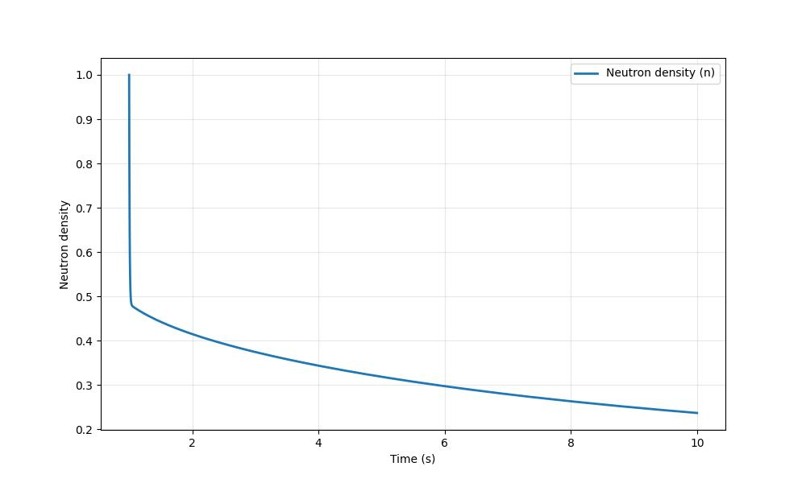 | 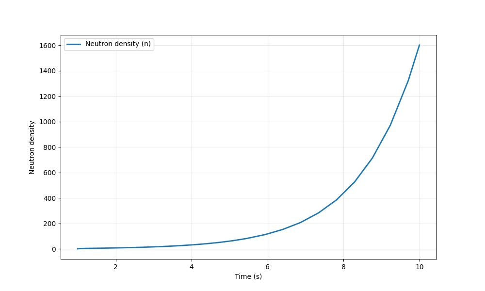 |
| $T_f$ +50 °C, $T_c$ −5 °C: Doppler broadening outweighs the moderator gain | $h = 1$ cm: exogenous absorption cuts the chain reaction | $T_f$ +110 °C, $T_c$ −70 °C: moderator feedback overwhelms Doppler, and $n(t)$ runs away exponentially |

The third case is an intentionally unphysical stress test — the correct result there is *instability*, and the model produces it.

- **Isolated sub-system transients before coupling.** The core thermal model was first exercised alone with a +10% power step, confirming sensible response times and magnitudes before any coupling was introduced:

| Fuel centreline | Fuel surface | Coolant |
|---|---|---|
| 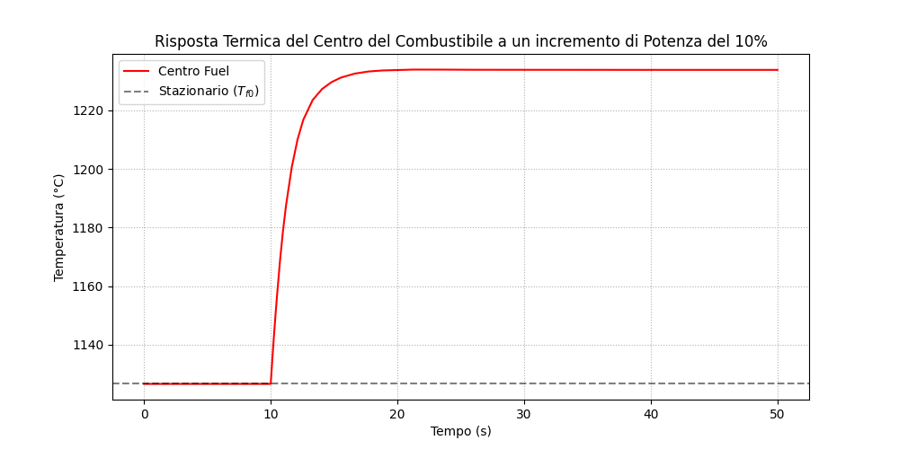 | 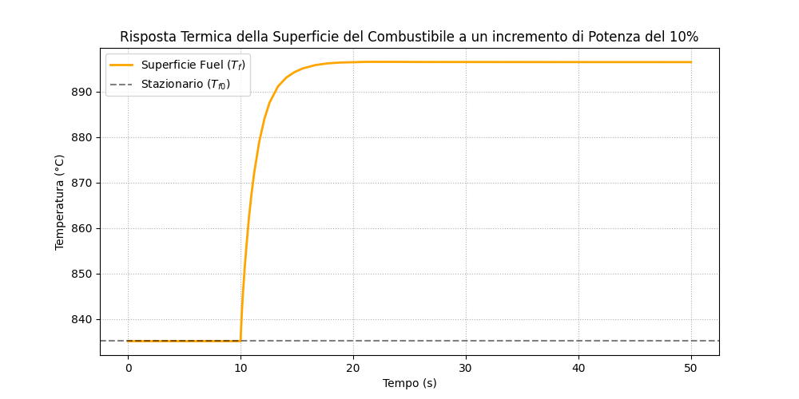 | 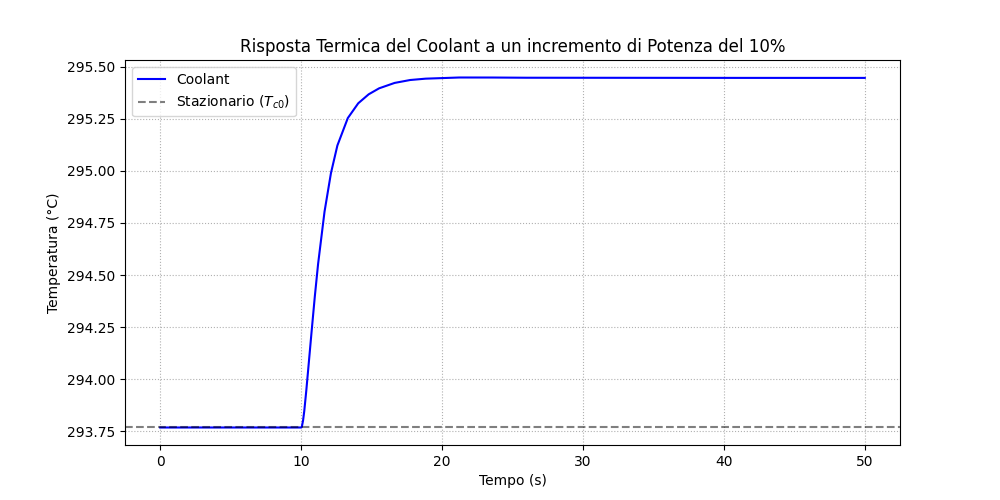 |

Note the physically-expected spread in response magnitude: a 10% power step moves the fuel centreline by ~100 °C, the fuel surface by ~60 °C, and the coolant by only ~1.7 °C.

- **Coupled neutronics + thermal-hydraulics, before adding the SG.** An intermediate step combined kinetics with the core thermal model under a primary flow step, with and without rods inserted:

| Flow +10%, rods fully out | Flow +10%, rods at 2 cm |
|---|---|
| 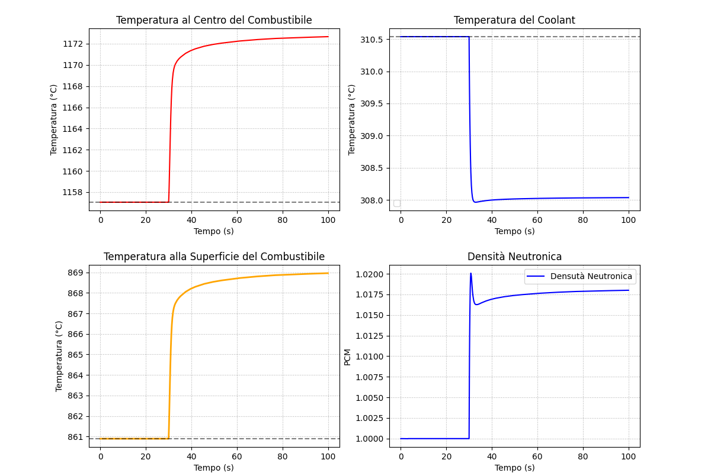 | 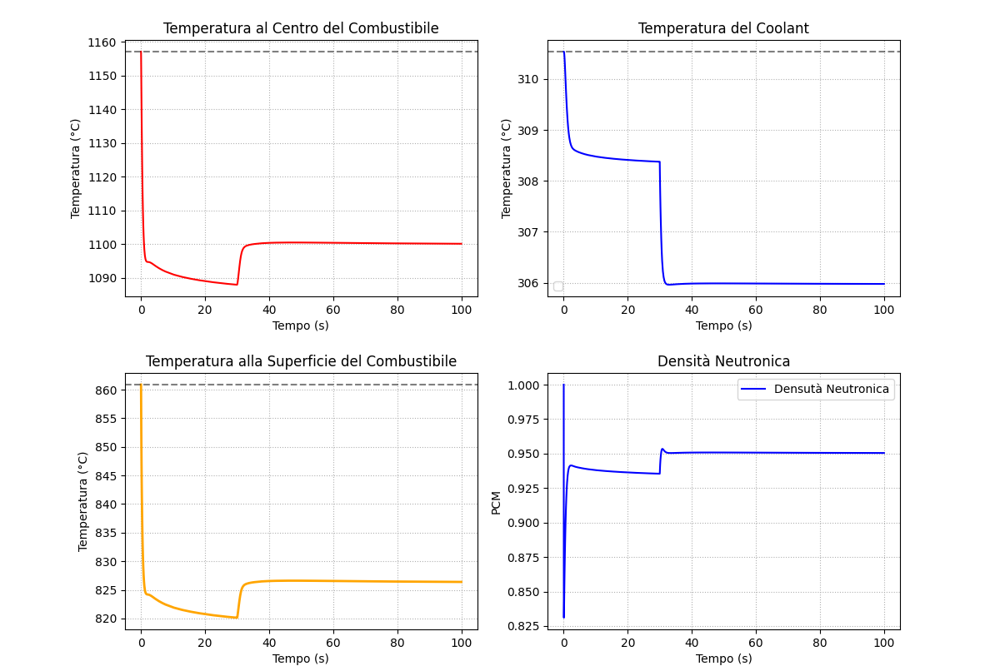 |

---

## Contributions

A five-person project, built collaboratively: rather than splitting into isolated
modules, we worked across the whole model together — kinetics, core thermal-hydraulics,
the steam generator, and the coupling layer.

Two iterations worth recording, since the final code doesn't show them:

- **Explicit → implicit.** The steam generator first ran on explicit Euler with a
  bisection-based shooting method for the steady state. It was replaced with
  unconditionally stable implicit Euler and Brent's method — trading extra bookkeeping
  (sequential semi-implicit sweeps instead of a direct update) for timesteps orders of
  magnitude larger.
- **A debugging story.** An early build of the coupled core + SG transient showed an
  unexplained instability from t = 0 — before any perturbation had been applied, which
  is what made it suspicious rather than merely wrong. The warm-up phase turned out to
  be the culprit: its timestep was too short relative to the secondary side's thermal
  time constant, so it never reached the discrete steady state. The "steady" initial
  condition handed to the transient solver was still quietly evolving. Lengthening the
  warm-up timestep fixed it — and the triple energy-balance check above is what made
  the diagnosis possible.

---

## Results

### A. Load-following — +10% secondary mass flow

Grid demand rises → the turbine valve opens → secondary flow increases by 10%. The causal chain that follows:

```
secondary flow ↑
   ├─► heat removed ↑ and heat-transfer coefficient ↑ (higher Re)
   └─► secondary pressure ↓  ─►  T_sat ↓  ─►  ΔT(primary–secondary) ↑
                                   │
                                   ▼
                        primary cooled  ─►  cold leg ↓
                                   │
                                   ▼
              denser coolant = better moderator  ─►  POSITIVE reactivity
                                   │
                                   ▼
                           core power ↑ to match demand
```

| Quantity | Baseline | After +10% flow |
|---|---|---|
| Exchanged thermal power | 174.66 MW | **183.67 MW (+5.2%)** |
| Neutron density $n/n_0$ | 1.000 | ≈ 1.050 |
| Secondary pressure | 34.0 bar | ≈ 32.0 bar |
| Cold leg | ≈ 280.5 °C | ≈ 272 °C |
| Hot leg | ≈ 316.5 °C | ≈ 310.3 °C |

**Starting point — nominal steady state along the exchanger.** The flat secondary plateau is the two-phase boiling region at saturation temperature; the sharp rise at the end is superheating.

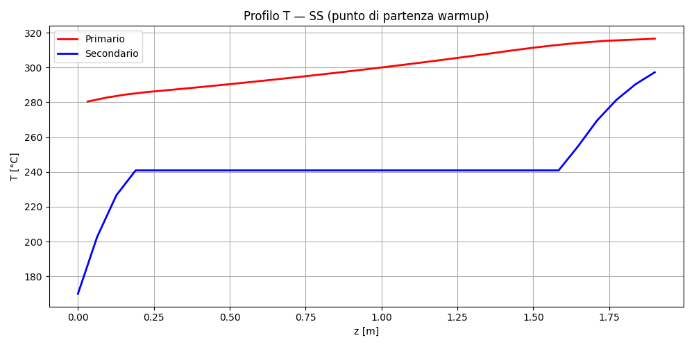

**Core response.** Fuel temperatures track neutron density upward. The heat-transfer coefficient climbs with secondary Reynolds number. Cladding temperature *falls*, following the cooling primary coolant:

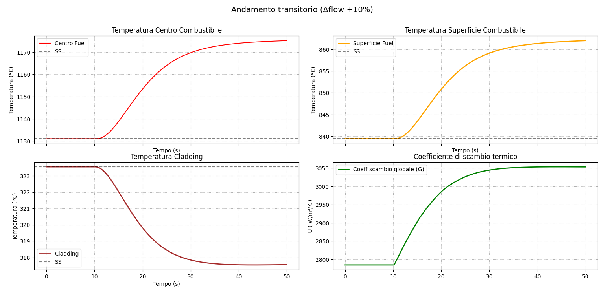

**Primary and secondary temperatures.** Everything settles lower — including, counter-intuitively, the hot leg, despite the core now producing *more* power. More heat is being removed than the extra power added:

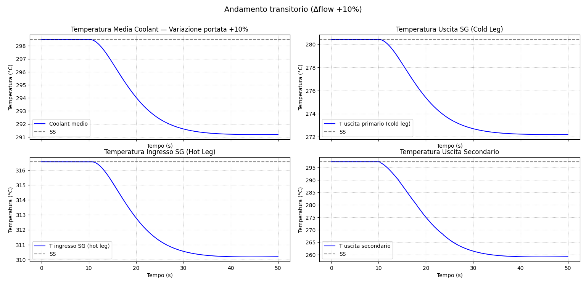

**Heat transfer and vapour quality.** Conductance rises and both resistances fall, driven by the higher secondary flow. Mean vapour quality drops slightly — more steam is being drawn off to the turbine, leaving a higher liquid fraction in the exchanger:

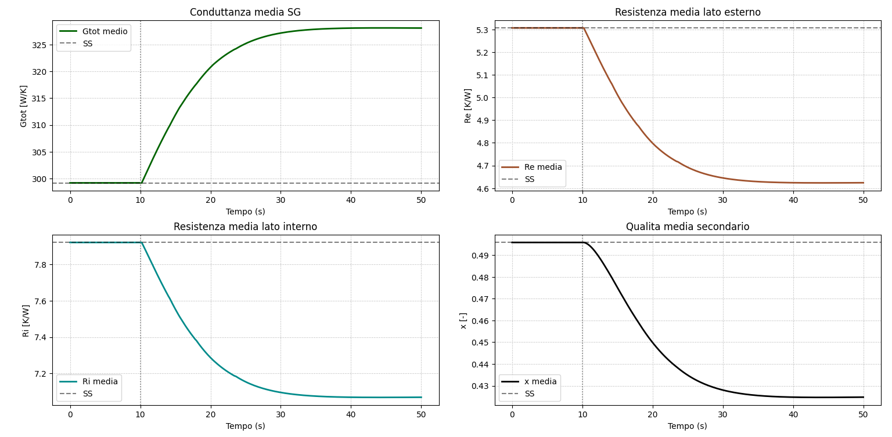

**Axial profiles, initial vs. final.** This is the most physically revealing plot in the set:

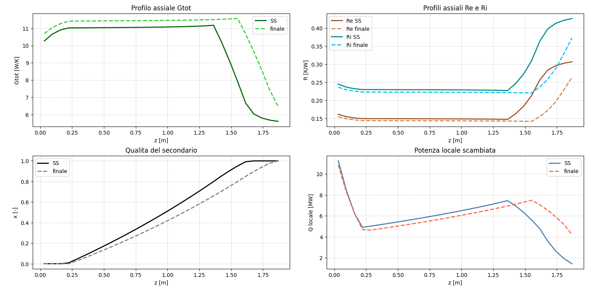

Three things stand out. The **liquid region** delivers intense heat transfer at the inlet — driven by a large ΔT that collapses as the temperatures converge. The **two-phase region** then keeps local power *high across most of the length* despite that shrinking ΔT, thanks to the exceptional heat transfer of nucleate boiling. The **vapour region** collapses, exactly as its poor conductance predicts. In the final state, quality reaches unity only near the very outlet — the steam entering the turbine is barely superheated, because the higher flow gives it less time to superheat.

### B. Upstream power control — 3 cm control-rod insertion

Same model, reversed causality: the perturbation now starts *inside the core*, with secondary flow and pressure held constant.

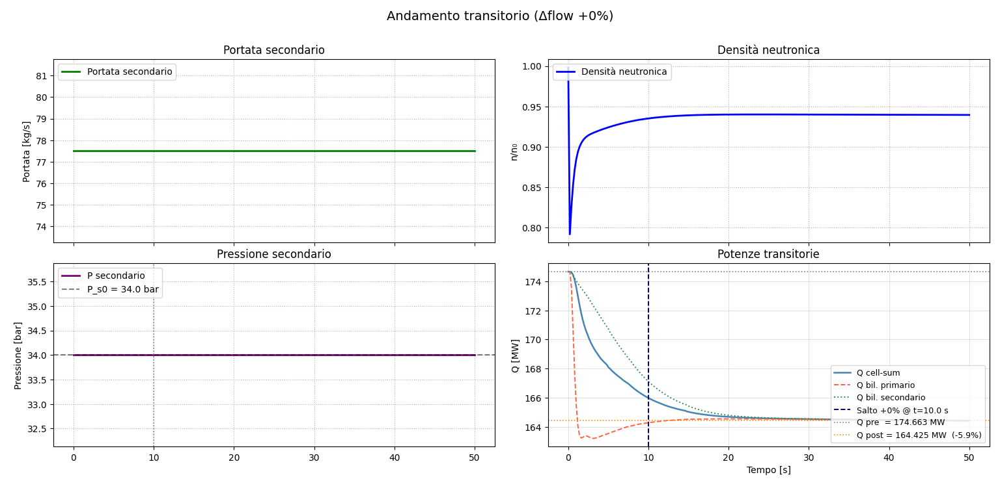

| Quantity | Baseline | After 3 cm insertion |
|---|---|---|
| Exchanged thermal power | 174.66 MW | **164.43 MW (−5.9%)** |
| Secondary flow / pressure | — | unchanged |

Neutron density drops sharply on insertion, then **partially recovers** — the primary coolant is cooling, growing denser, and moderating better — before settling below its initial value.

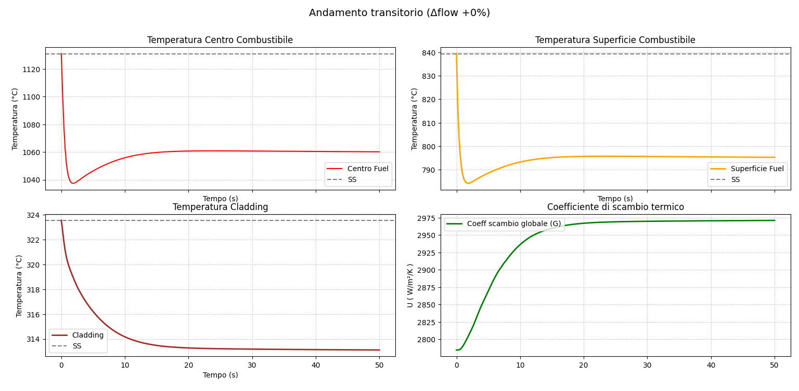

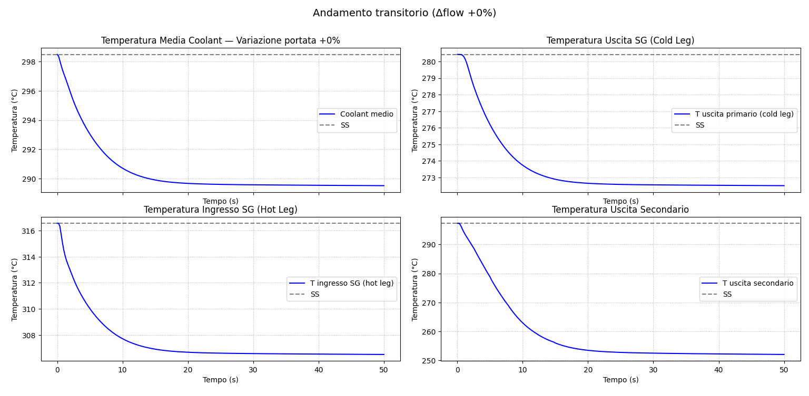

**An instructive apparent paradox.** Exchanged power falls — yet the overall heat-transfer coefficient *rises*:

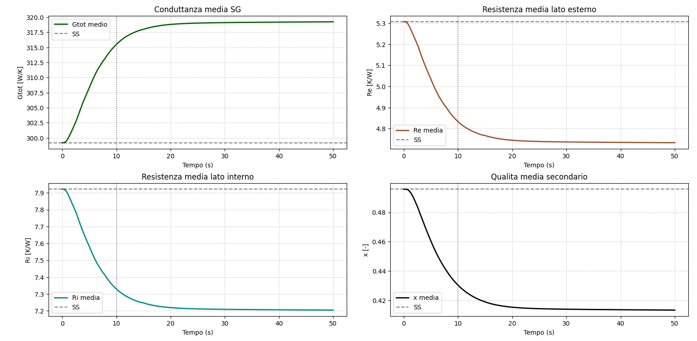

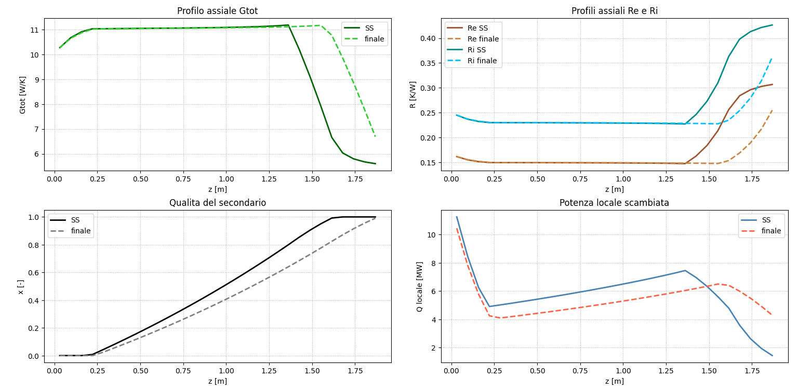

The resolution: with less heat entering it, the secondary fluid evaporates more slowly, so the excellent-conductance two-phase region **occupies more of the exchanger's length** — pushing the mean coefficient up. Power still falls because the mean primary–secondary ΔT shrinks much faster than the coefficient grows, and it shrinks asymmetrically: the secondary profile is pinned near its saturation temperature (pressure is constant here), while the primary drops freely. In scenario A that pinning was absent, because pressure was free to move — which is precisely why the same coupled model produces opposite-looking behaviour in the two cases.

### The physics takeaway

The two scenarios are the two power-control modes real PWR/SMR plants use, and the same model reproduces both with inverted causal chains:

| | **Upstream control** (scenario B) | **Downstream control** (scenario A) |
|---|---|---|
| Actuator | Control rods in the core | Secondary pump / turbine valve |
| Chain direction | Core → SG → turbine | Turbine → SG → core |
| Direction of change | Power reduction (rods normally fully withdrawn at nominal) | Increase or decrease |
| Mechanism | Direct, commanded | **Self-regulating** via moderator feedback — *load-following* |

Scenario A is the more interesting result: the reactor raises its own power to meet a downstream demand change, with no operator or control-rod action at all. That self-regulation is an inherent property of PWR-type reactors, and reproducing it from first principles — rather than assuming it — was the point of building the coupled model.

---

## Assumptions and limitations

Stated deliberately, as in the original report:

- **0D neutronics.** Spatial flux shape is neglected. Adequate for the global transient behaviour studied here; not for local power-peaking.
- **Lumped 3-node core model.** Captures the radial fuel gradient without full CFD.
- **Linearised reactivity feedback.** $\alpha_f$, $\alpha_m$, $\alpha_h$ are treated as constants — a first-order approximation valid for operational transients near nominal conditions, not for large excursions.
- **Single representative sub-channel** in the SG, scaled to the full 9,912-channel system assuming even flow distribution.
- **Constant material properties** in the exchanger walls; fluid volume changes neglected.
- **The SG inlet region is neglected**, where the exchanged power is negligible compared with the rest of the unit.
- **Phenomenological pressure model.** $\tau_p$ is assumed rather than derived. In the standalone model this is a first-order approximation; in the fully coupled system the underlying feedback (via $T_{sat}(P_s)$) is captured more rigorously.
- **Saturated-fluid assumption** in the pressure balance introduces error only in the subcooled inlet zone, which occupies roughly 15–20% of the length.

## Repository structure
```
.
├── README.MD             
├── main_ENG.py                 # main file in English  
├── main_ITA.py                 # main file in Italian
├── Src/
│   ├── Steam_Generator.py      # finite-volume SG, implicit Euler
│   ├── Thermohydraulics.py     # 3-node fuel / cladding / coolant
│   ├── Neutronics.py           # Neutronics kinetics
│   └── Thermohyd+neutronics.py # the Neutronics and Thermohydraulics files combined togheter      
├── assets/                     # figures used in this README
├── Docs/
│   ├── Report(English).pdf     # full technical report (English)
│   └── Report(Italian).pdf     # full technical report (Italian)

```

## Getting started

You have to install the following libraries on python
```
numpy
scipy
pyXSteam
matplotlib
```

---

## Figures and full report

All figures in this README come from the project's technical report, included in `docs/`. **Plot labels are in Italian** — a short glossary:

| Italian | English |
|---|---|
| Portata | Mass flow rate |
| Pressione | Pressure |
| Densità neutronica | Neutron density |
| Potenza / Potenze transitorie | Power / transient powers |
| Temperatura | Temperature |
| Combustibile (centro / superficie) | Fuel (centreline / surface) |
| Rivestimento / Cladding | Cladding |
| Refrigerante / Coolant | Coolant |
| Conduttanza / Resistenza | Conductance / resistance |
| Titolo (x) | Vapour quality |
| Scambio termico | Heat transfer |
| Mantello / Tubo | Shell / tube |
| Salto | Step (perturbation) |
| SS (stazionario) | Steady state |

The two steam-generator layout drawings (`fig4-1`, `fig4-2`) appear to be reproduced from published literature rather than drawn for this project — check their original source and add the proper credit line before making the repository public.

## References

1. Han, G. Y. "A mathematical model for the thermal-hydraulic analysis of nuclear power plants." *International Communications in Heat and Mass Transfer* 27.6 (2000): 795–805.
2. Carbajo, J. J. et al. "A review of the thermophysical properties of MOX and UO₂ fuels." *Journal of Nuclear Materials* 299.3 (2001): 181–198.
3. Gaganov, A. "Dynamic analysis of land-based SMR RITM-200 and passive residual heat removal system." MSc thesis, Politecnico di Milano, 2025.
4. Lombardi, C. *Impianti nucleari*. Città Studi, 2006.

## Team and academic context

Developed for the Nuclear Engineering Laboratory (*Laboratorio di Ingegneria Nucleare*), **Politecnico di Milano**, AY 2025–2026.

- Ettore Carlotti
- Andrea Ferroni
- Gabriele Melchionda
- **Vsevolod Ozmitel Volpato**
- Giuseppe Praino

## License

No license is set yet, but for information contact Politecnico di Milano. If you want others to be able to reuse this code, consider adding one — MIT is a common, permissive choice for portfolio and academic repositories.

---

**Contact:** www.linkedin.com/in/ozmitelvsevolod
